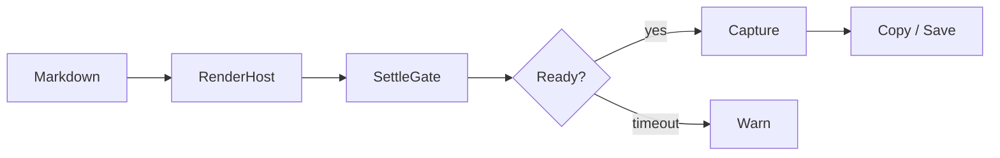
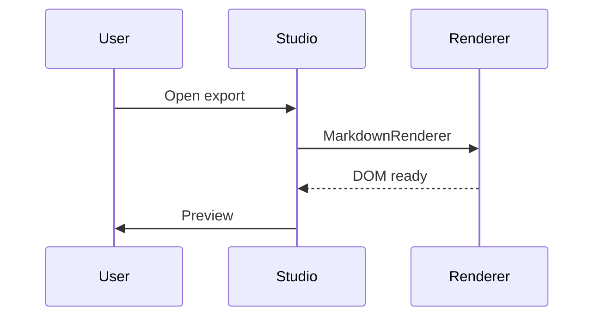

# Export Img · 导出保真测试笔记

> 把这篇笔记放入开发库，用 **Export Img** 导出，并对照阅读视图验收。

## 1. 标题层级

### 1.1 三级标题
#### 1.1.1 四级标题
##### 五级标题
###### 六级标题

正文段落：这是一段普通文字，包含 **粗体**、*斜体*、~~删除线~~、==高亮==、`行内代码`，以及自动链接 https://obsidian.md 。

## 2. 列表

无序列表：
- 苹果
- 香蕉
  - 子项 A
  - 子项 B
- 樱桃

有序列表：
1. 第一步：准备笔记
2. 第二步：打开 Export Studio
3. 第三步：等待 Settle → Ready
4. 第四步：复制或保存

任务列表：
- [x] Callout
- [x] 代码高亮
- [ ] 本地图片（请替换为 vault 内真实图片）
- [ ] 嵌入笔记

## 3. 引用与 Callout

> 普通引用块：保真导出应保留主题字体与边距。

> [!note] Note
> 这是 note callout，用于检查图标、标题栏与正文间距。

> [!tip] Tip
> 嵌套列表：
> 1. 打开设置
> 2. 调整边距后导出

> [!warning] Warning
> 若 Settle 显示 **Timed out**，先检查远程图或 Mermaid 是否加载完成。

> [!quote] Quote
> 「所见即所得」应以阅读视图为基准。

## 4. 分隔线

上方内容。

---

下方内容（可用「按分隔线」分页模式测试）。

## 5. 表格

功能对照表：

| 功能 | 期望 | 结果 |
| :--- | :--- | :--- |
| 主题色 | 与阅读视图一致 | — |
| Callout | 图标与边框完整 | — |
| 代码块 | 高亮与滚动正常 | — |
| 公式 | 行内 / 块级清晰 | — |
| Mermaid | 图形完整 | — |

宽表滚动检查：

| Col A | Col B | Col C | Col D | Col E | Col F |
| ----- | ----- | ----- | ----- | ----- | ----- |
| 1 | 2 | 3 | 4 | 5 | 6 |
| alpha | beta | gamma | delta | epsilon | zeta |
| 中文 | 测试 | 单元格 | 内容 | 对齐 | 完成 |

## 6. 代码

行内：`const scale = 2`

TypeScript：

```ts
export interface CaptureOptions {
  scale: number;
  format: 'png' | 'jpg' | 'webp';
}

export async function capture(el: HTMLElement, options: CaptureOptions) {
  // 注释：检查关键字高亮与行距
  return el.getBoundingClientRect();
}
```

Shell：

```bash
pnpm run build
pnpm run dev
```

JSON：

```json
{
  "id": "obsidian-export-img",
  "version": "1.0.0",
  "features": ["padding", "i18n", "settle"]
}
```

## 7. 数学公式

行内公式：$E = mc^2$，$a_i = \sum_{k=1}^{n} x_k$。

块级公式：

$$
\int_{0}^{1} x^{2}\,dx = \frac{1}{3}
$$

$$
\begin{pmatrix}
a & b \\
c & d
\end{pmatrix}
\begin{pmatrix}
x \\
y
\end{pmatrix}
=
\begin{pmatrix}
ax+by \\
cx+dy
\end{pmatrix}
$$

## 8. Mermaid





## 9. 链接与双向链接

- 外部链接：[Obsidian Help](https://help.obsidian.md)
- Wiki 链接：[[Related note|相关笔记]]
- 未解析链接：[[ThisNoteDoesNotExist]]

## 10. 图片与嵌入

请将下列占位替换为 vault 内真实资源后再测：

本地 / wiki 嵌入图：
![[paste-local-image-here.png]]

远程图（CORS / requestUrl）：


笔记嵌入（若目标存在）：
![[Related note]]

## 11. 脚注与特殊段落

段落含脚注引用[^1]，以及第二个引用[^long]。

[^1]: 短脚注内容。
[^long]: 较长脚注：用于检查导出时脚注区是否被截断。

HTML（部分主题支持）：
<small>小号说明文字</small>

注释块（若开启）：
%% 这是 Obsidian 注释，阅读视图通常不显示 %%

## 12. 长文压力段

重复段落用于测试滚动、分页与 Settle：

Lorem ipsum dolor sit amet, consectetur adipiscing elit. Sed do eiusmod tempor incididunt ut labore et dolore magna aliqua. Ut enim ad minim veniam, quis nostrud exercitation ullamco laboris.

中文长段：导出图片插件应以阅读视图为视觉基准，尽量还原主题、Callout、代码高亮、公式与图表。若预览区与最终截图不一致，优先排查 RenderHost 类名、边距与 Settle 等待逻辑。

---

## 验收清单

1. Studio 边距默认接近阅读视图，可在「文档边距 / 预设边距」间切换
2. Settle 到 Ready 后再 Copy / Save（预览 1×；导出用设定倍率）
3. 浅色 / 深色 / 当前主题各导出一次对比
4. 打开装饰：水印文字 + 作者栏，确认不遮挡关键内容
5. 长文分页：fixed / hr / auto 各试一次；固定高度默认 = 宽度 × 1.414
6. 勾选显示 Properties，预览中应出现 frontmatter
7. 分辨率 2×/3× 后放大**导出图**（非预览），文字与线条应更清晰
