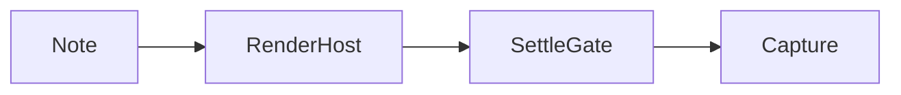

---
tags:
  - fidelity
  - export-img
cssclasses:
  - export-img-fixture
---

# Fidelity checklist

Use this note in a **dev vault** to verify Export Img against Reading view.

## Callout

> [!note] Callout title
> Nested content with **bold** and `code`.

> [!warning]
> Warning callout body.

## Code

```ts
export function hello(name: string): string {
  return `Hello, ${name}`;
}
```

## Math

Inline $E = mc^2$ and block:

$$
\int_{0}^{1} x^2 \, dx = \frac{1}{3}
$$

## Mermaid



## Lists & table

- Item one
- Item two
  - Nested

| Col A | Col B |
| ----- | ----- |
| 1     | 2     |

## Embeds

Replace with a real vault image:

![[paste-local-image-here.png]]

Remote (optional):


---

Page break marker for HR split mode.
